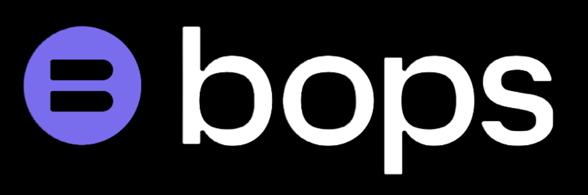

# Bops Full Demo Application

Hey Bops Team!  Here is the raw source code for your fully functional demo.  It should up up and running with just 2 commands (listed below) as long as you have npm and node correctly installed.  Remeber that this is an MVP and we want to learn as much as we can from it so that we are able to make improvements over time.  Feel free to let us know any of your comments or questions and have fun testing!

## Installation and Start-up

In the project directory, run:

### `npm install`

Make sure you install all required dependencies to the project before

### `npm start`

Runs the app in the development mode.\
Open [http://localhost:3000](http://localhost:3000) to view it in your browser.

The page will reload when you make changes.\
You may also see any lint errors in the console.
